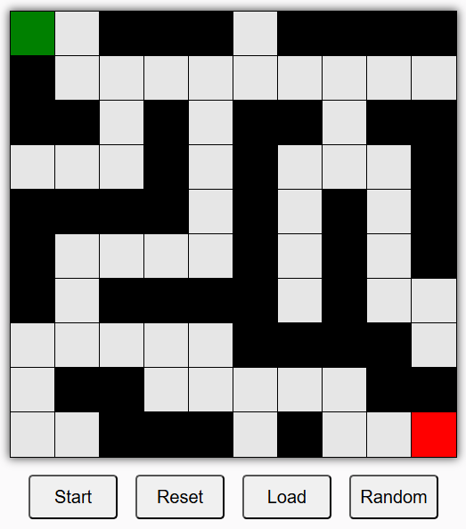

# Maze Solver

This project is a Maze Solver application built with React. It uses the Breadth-First Search (BFS) algorithm to find the shortest path from the start point to the end point in a maze.

## Features

- Generate a random binary maze
- Load a predefined demo maze
- Visualize the BFS algorithm solving the maze
- Interactively modify the maze by clicking on cells
- Reset the maze to its initial state

## Components

The `Maze` component is the main component that renders the maze grid and controls the maze-solving process. It includes buttons to start the BFS algorithm, reset the maze, load a demo maze, and generate a random maze.

## Services

The `mazeService` module provides functions to generate a binary maze, reset the maze, and perform the BFS algorithm to find the shortest path.

## Usage

1. Clone the repository.
2. Install the dependencies using `npm install`.
3. Start the development server using `npm start`.
4. Open the application in your browser.

## Example

An example of a predefined demo maze:

```
[
    ["S", 0, 1, 1, 1, 0, 1, 1, 1, 1],
    [1, 0, 0, 0, 0, 0, 0, 0, 0, 0],
    [1, 1, 0, 1, 0, 1, 1, 0, 1, 1],
    [0, 0, 0, 1, 0, 1, 0, 0, 0, 1],
    [1, 1, 1, 1, 0, 1, 0, 1, 0, 1],
    [1, 0, 0, 0, 0, 1, 0, 1, 0, 1],
    [1, 0, 1, 1, 1, 1, 0, 1, 0, 0],
    [0, 0, 0, 0, 0, 1, 1, 1, 1, 0],
    [0, 1, 1, 0, 0, 0, 0, 0, 1, 1],
    [0, 0, 1, 1, 1, 0, 1, 0, 0, "E"]
]
```

- `S` represents the start point.
- `E` represents the end point.
- `0` represents a path.
- `1` represents a wall.

## Screenshot
